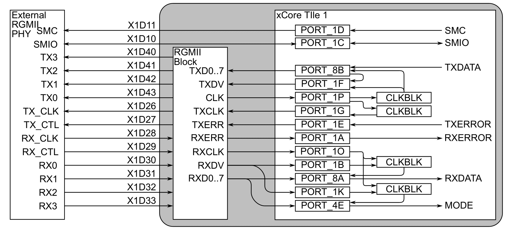
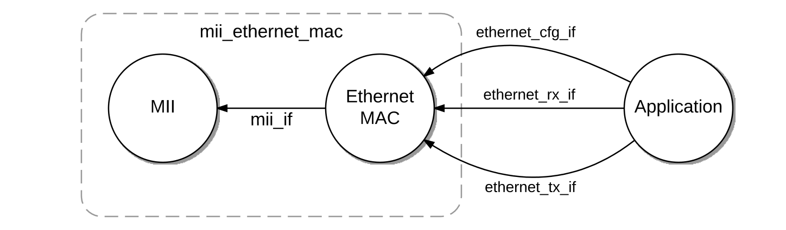
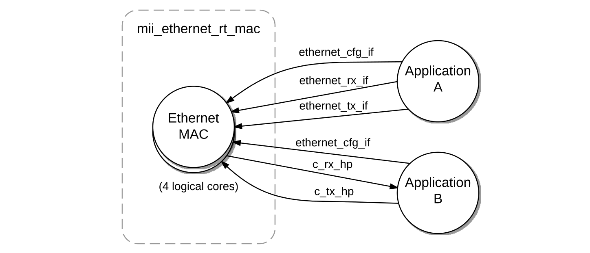
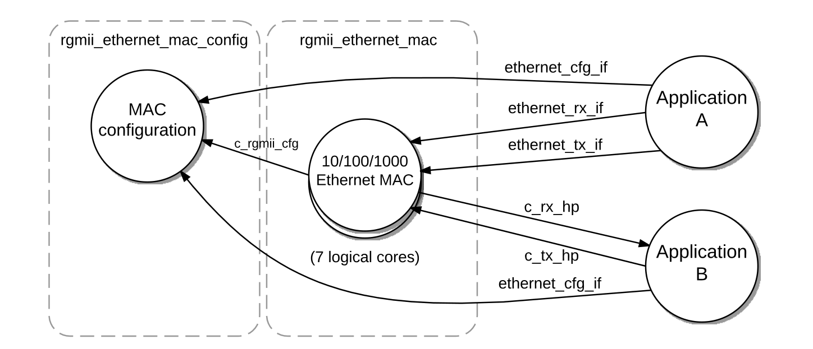

##############################
lib_ethernet: Ethernet library
##############################

|newpage|

************
Introduction
************

``lib_ethernet`` allows interfacing to MII, RMII or RGMII Ethernet PHYs and provides the Media Access Control (MAC) function
for the Ethernet stack.

Various MAC blocks are available depending on the XMOS architecture selected, desired PHY interface and line speed, as described in :numref:`ethernet_supported_macs`.

.. _ethernet_supported_macs:
.. list-table:: Ethernet MAC support by XMOS device family
 :widths: 30 20 20 20 20
 :header-rows: 1

 * - XCORE Architecture
   - MII 100 Mb
   - RMII 100 Mb
   - GMII 1 Gb
   - RGMII 1 Gb
 * - XS1
   - Deprecated from version 4.0.0
   - N/A
   - N/A
   - N/A
 * - XS2 (xCORE-200)
   - Supported
   - N/A
   - N/A
   - Supported
 * - XS3 (xcore.ai)
   - Supported
   - Supported
   - Contact XMOS
   - N/A

The MII MAC is available as two types; a low resource usage version which provides standard layer 2 data access to an array of clients, and a real-time version which offers additional hardware features including:

 * Hardware time-stamping of point of ingress and egress of frames supporting standards such as IEEE 802.1AS.
 * Support for high priority send and receive queues and receive filtering. This allows time sensitive traffic to be prioritised over other traffic.
 * Traffic shaping on egress using an IEEE 802.1Qav compliant credit based shaper.
 * Configurable VLAN tag stripping on received frames.

All RMII and RGMII implementations offer the 'real-time' features as standard. See the :ref:`rt_mac_section` section for more details.

In addition, all MACs support client specific filtering for both source MAC address and Ethertype. See the :ref:`standard_mac_section` section for more details.

``lib_ethernet`` is intended to be used with `XCommon CMake <https://www.xmos.com/file/xcommon-cmake-documentation/?version=latest>`_
, the `XMOS` application build and dependency management system.

To use ``lib_ethernet`` in an application, add ``lib_ethernet``, to the list of dependent modules in the application's `CMakeLists.txt` file.

  set(APP_DEPENDENT_MODULES "lib_ethernet")

All `lib_ethernet` functions can be accessed via the ``ethernet.h`` header file::

  #include <ethernet.h>

|newpage|

**********************
Typical resource usage
**********************

Instantiating Ethernet on the XCORE requires resources in terms of memory, threads (MIPS), ports and other resources.
The amount required depends on the feature set of the MAC. :numref:`ethernet_mac_resource_usage` summarises the main requirements.

.. _ethernet_mac_resource_usage:
.. list-table:: Ethernet MAC XCORE resource usage
 :widths: 25 7 25 7 9 7
 :header-rows: 1

 * - Configuration
   - Pins
   - Port Requirement
   - Clocks
   - RAM
   - Threads
 * - 10/100 Mb/s standard MII
   - 13
   - 5 (1-bit), 2 (4-bit), 1 (any-bit)
   - 2
   - ~16 k
   - 2
 * - 10/100 Mb/s Real-Time MII
   - 13
   - 5 (1-bit), 2 (4-bit)
   - 2
   - ~23 k
   - 4
 * - 10/100 Mb/s Real-Time RMII
   - 7
   - 3 (1-bit), 2 (4-bit) or 4 (1-bit)
   - 2
   - ~25 k
   - 4
 * - 10/100/1000Mb/s RGMII
   - 12
   - 8 (1-bit), 2 (4-bit), 2 (8-bit)
   - 4
   - ~102 k
   - 8
 * - Raw MII
   - 13
   - 5 (1-bit), 2 (4-bit)
   - 2
   - ~10 k
   - 1
 * - SMI (MDIO)
   - 2
   - 2 (1-bit) or 1 (multi-bit)
   - 0
   - ~1 k
   - 0

.. note::
    Not all ports are brought out to pins since they are used internally to the device.
    Hence the total port bit-count may not always match the required device pin count.

.. note::
    The SMI configuration API is a function call and so uses no dedicated threads. It
    blocks until the last bit of the transaction is complete.

|newpage|

.. _standard_mac_section:

*********************
Standard MAC Features
*********************

All MACs in this library support a number of useful features which can be configured by clients.

  * Support for multiple clients (Rx and Tx) allowing many tasks to share the MAC.
  * Configurable Ethertype and MAC address filters for unicast, multicast and broadcast addresses and is configurable per client. The number of entries is configurable using ``ETHERNET_MACADDR_FILTER_TABLE_SIZE``.
  * Configurable source MAC address. This may be used in conjunction with, for example, lib_otp to provide a unique MAC address per XMOS chip.
  * Link state detection allowing action to be taken by higher layers in the case of link state change.
  * Separately configurable Rx and Tx buffer sizes (queues).
  * VLAN aware packet reception. If the VLAN tag (0x8100) is seen the the header length is automatically extended by 4 octets to support the Tag Protocol Identifier (TPID) and Tag Control Information (TCI).

Transmission of packets is via an API that blocks until the frame has been copied into the transmit queue. Reception of a packet can be a blocking call or combined with a notification allowing the client to ``select`` on the receive interface whereupon it can then receive the waiting packet. Please see the :ref:`api_section` for details on how to use the MAC.

In addition the RMII RT MAC supports an exit command. This tears down all tasks associated with the MAC and frees the memory and xcore resources used, including ports. This can be helpful in cases where ports may be shared (eg. Flash memory) allowing DFU support in package constrained systems. It may also be used to support multiple connect PHY devices where redundancy is required, without costing the chip resources to support multiple MACs.

|newpage|

.. _rt_mac_section:

**********************
Real-Time MAC Features
**********************

In addition to all of the features outlined in the :ref:`standard_mac_section` section, real-time (RT) MACs offer enhanced features which are useful in a number of applications such as industrial control, real-time networking and Audio/Video streaming cases. These specific features are introduced below.

Hardware Time Stamping
======================

The XCORE contains architectural features supporting precise timing measurements. Specifically, a 100 MHz timer is included and the RT MACs make use of this to timestamp packets at the point of ingress and egress. This 100 MHz, 32-bit timer value has a resolution of 10 nanoseconds and the provided timestamp can be converted to nanoseconds by multiplying by 10.

When receiving packets, a reference to a structure of type ``ethernet_packet_info_t`` contains the timestamp of the received packet at point of ingress.

When transmitting packets, an additional Tx API is provided for the RT MAC which blocks until the packet has been transmitted and returns the time of egress.

These features, along with APIs to tune the ingress and egress latency offsets, can be used by higher layers such as IEEE 802.1AS (Timing and Synchronization) or PTP (IEEE 1588) to implement precise timing synchronisation across the network.

High Priority Queues
====================

The RT MACs extend the standard client interfaces with the support of High Priority (HP) queues. These queues allow certain traffic to be received or transmitted before lower priority traffic, which is useful in real-time applications where the network is shared with normal, lower priority, traffic. The MAC logic always prioritises HP packets and queues over low priority.

HP traffic has it's own dedicate queues inside the MAC providing separation from other traffic.

The dedicated HP client interfaces use streaming channels instead of XC interfaces which provide higher performance data transfer. A dedicated channel is used for each of the receive and transmit interfaces. Streaming channels offer higher performance at the cost of occupying a dedicated switch path which may require careful consideration if the client is placed on a different tile from the MAC. This is important due to the architectural limitation of a maximum of four inter-tile switch paths between tiles. A maximum of one HP receive and transmit client are be supported per MAC.

A flag in the filter table can manually be set when making filter entries which is then used to determine the priority level when receiving packets. This determines which queue to use.

A dedicated API is provided to send and receive the HP packets.

The transmit HP queue is optionally rate limited using using the Credit Based Shaper which is described below. Together, these features provide the machinery required by IEEE 802.1Qav, allowing reliable, low-latency delivery of time-sensitive streams over Ethernet networks.

Credit Based Shaper
===================

The Credit Based Shaper (CBS) uses the following mechanisms to manage egress rate:

  * Credits: Each port or queue is assigned a "credit" that increases or decreases over time based on the network's traffic conditions.
  * Idle Slope: Determines how quickly credits increase when the queue is idle (i.e., waiting to transmit).
  * Send Slope: Determines how quickly credits decrease when the queue is actively transmitting.
  * Bandwidth Limitation: CBS limits the bandwidth of non-time-sensitive traffic, ensuring reserved bandwidth for high-priority streams.

If the credit is positive, the traffic stream is eligible for transmission. If the credit is negative, the traffic stream is paused until the credit returns to a positive state. By spreading traffic out evenly over time using a CBS, the queue size in each bridge and endpoint can be shorter, which in turn reduces the latency experienced by traffic as it flows through the system.

The RT MACs are passed an enum when instantiated allowing enabling or disabling of the CBS. In addition the MAC provides an API which adjusts the high-priority TX queue's credit based shaper's idle slope dynamically.

The idle slope passed is a fractional value representing the number of bits per reference timer tick in a Q16.16 format defined by ``MII_CREDIT_FRACTIONAL_BITS`` allowing very precise control over bandwidth reservation. Please see the :ref:`api_section` for details and an example of how to convert from bits-per-second to the slope argument.

VLAN Tag Stripping
==================

In addition to standard MAC VLAN awareness of received packets when calculating payload length, the RT MAC also includes a feature to automatically strip VLAN tags. This is done inside the MAC so that the application can just treat the incoming packet as a standard Ethernet frame. VLAN stripping is dynamically controllable on a per-client basis. 

|newpage|

***************************
External signal description
***************************

.. _mii_signals_section:

MII: Media Independent Interface
================================

MII is an interface standardized by IEEE 802.3 that connects different types of PHYs to the same Ethernet Media Access Control (MAC).
The MAC can interact with any PHY using the same hardware interface, independent of the media the PHYs are connected to.

The MII transfers data using 4 bit words (nibbles) in each direction, clocked at 25 MHz to achieve 100 Mb/s data rate.

An enable signal (TXEN) is set active to indicate start of frame and remains active until it is completed.
A clock signal (TXCLK) clocks nibbles (TXD[3:0]) at 2.5 MHz for 10 Mb/s mode and 25 MHz for 100 Mb/s mode.
The RXDV signal goes active when a valid frame starts and remains active throughout a valid frame duration.
A clock signal (RXCLK) clocks the received nibbles (RXD[3:0]). :numref:`mii_signals` describes the MII signals:

.. _mii_signals:
.. list-table:: MII signals
 :header-rows: 1

 * - Port Requirement
   - Signal Name
   - Description
 * - 4-bit port [Bit 3]
   - TXD3
   - Transmit data bit 3
 * - 4-bit port [Bit 2]
   - TXD2
   - Transmit data bit 2
 * - 4-bit port [Bit 1]
   - TXD1
   - Transmit data bit 1
 * - 4-bit port [Bit 0]
   - TXD0
   - Transmit data bit 0
 * - 1-bit port
   - TXCLK
   - Transmit clock (2.5/25 MHz)
 * - 1-bit port
   - TXEN
   - Transmit data valid
 * - 1-bit port
   - RXCLK
   - Receive clock (2.5/25 MHz)
 * - 1-bit port
   - RXDV
   - Receive data valid
 * - 1-bit port
   - RXERR
   - Receive data error
 * - 4-bit port [Bit 3]
   - RX3
   - Receive data bit 3
 * - 4-bit port [Bit 2]
   - RX2
   - Receive data bit 2
 * - 4-bit port [Bit 1]
   - RX1
   - Receive data bit 1
 * - 4-bit port [Bit 0]
   - RX0
   - Receive data bit 0

Any unused 1-bit and 4-bit xCORE ports can be used for MII provided that they are on the same tile and there is enough
resource to instantiate the relevant Ethernet MAC component on that tile.

.. _rmii_signals_section:

RMII: Reduced Media Independent Interface
=========================================

RMII is an interface standardized by IEEE 802.3 that connects different types of PHYs to the same Ethernet Media Access Control (MAC).
The MAC can interact with any PHY using the same hardware interface, independent of the media the PHYs are connected to. It offers
similar functionality to MII however offers a reduced pin-count.

The RMII transfers data using 2 bit words (half-nibbles) in each direction, clocked at 50 MHz to achieve 100 Mb/s data rate.

An enable signal (TXEN) is set active to indicate start of frame and remains active until it is completed.
A common clock signal clocks 2 bits (TXD[1:0]) at 50 MHz for 100 Mb/s mode.
The RXDV signal goes active when a valid frame starts and remains active throughout a valid frame duration.
A common clock signal clocks the received half-nibbles (RXD[1:0]).

Note that either half of a 4-bit port (upper or lower pins) may be used for data or alternatively two 1-bit ports may be used. This
provides additional pinout flexibility which may be important in applications which use low pin-count packages. Both Rx and Tx
have their port type set independently and can be mixed. Unused pins on a 4-bit port are ignored for Rx and driven low for Tx.

.. note::
    By default most RMII PHYs supply a CRS_DV signal (carrier sense) instead of an RX_DV data valid strobe. This library requires
    the PHY to be configured so that the receive data strobe is set to RX_DV mode. Please check your chosen PHY supports this.

The RMII MAC requires a minimum thread speed of 75 MHz which allows all 8 hardware threads to be used on a 600 MHz xcore.ai device.

:numref:`rmii_signals` describes the RMII signals:

.. _rmii_signals:
.. list-table:: RMII signals
 :header-rows: 1

 * - Port Requirement
   - Signal Name
   - Description
 * - 4-bit port [Bit 1 or 3] or 1-bit port
   - TXD1
   - Transmit data bit 1
 * - 4-bit port [Bit 0 or 2] or 1-bit port
   - TXD0
   - Transmit data bit 0
 * - 1-bit port
   - PHY_CLK
   - PHY clock (50 MHz)
 * - 1-bit port
   - TXEN
   - Transmit data valid
 * - 1-bit port
   - RXDV
   - Receive data valid
 * - 4-bit port [Bit 1 or 3] or 1-bit port
   - RX1
   - Receive data bit 1
 * - 4-bit port [Bit 0 or 2] or 1-bit port
   - RX0
   - Receive data bit 0

Any unused 1-bit and 4-bit xCORE ports can be used for RMII providing that they are on the same Tile and there is enough
resource to instantiate the relevant Ethernet MAC component on that Tile.

.. _rgmii_signals_section:

RGMII: Reduced Gigabit Media Independent Interface
==================================================

RGMII requires half the number of data pins used in GMII by clocking data on both the rising and the falling edges of the
clock, and by eliminating non-essential signals (carrier sense and collision indication).

xCORE-200 XE/XEF devices have a set of pins that are dedicated to communication with a Gigabit Ethernet PHY or switch via RGMII,
designed to comply with the timings in the RGMII v1.3 specification.

RGMII supports Ethernet speeds of 10 Mb/s, 100 Mb/s and 1000 Mb/s.

The Ethernet MAC implements ID mode as specified by RGMII. TX clock from xCORE to PHY is delayed. Default 10/100 and
1000 Mb/s delays are set in rgmii_consts.h to an integer number of system clock ticks (e.g. 1 x 2ns if system clock
is 500MHz):

.. literalinclude:: ../../lib_ethernet/src/rgmii_consts.h
   :start-at: RGMII_DELAY
   :end-at: RGMII_DELAY_100M

Note that some Ethernet PHY operate in "hybrid mode" and apply skew compensation on incoming TX clock. You may need to
adjust this compensation, disable it, or set the above delay to 0 in the Ethernet MAC.

The Ethernet MAC will expect RX clock from PHY to xCORE be delayed by 1.2-2ns as specified by RGMII.

The pins and functions are listed in Table 2. When the 10/100/1000 Mb/s Ethernet MAC is instantiated these pins can
no longer be used as GPIO pins, and will instead be driven directly from a Double Data Rate RGMII block, which in turn
is interfaced to a set of ports on Tile 1. :numref:`rgmii_signals` describes the RGMII pins and signals:

.. _rgmii_signals:
.. list-table:: RGMII pins and signals
 :header-rows: 1

 * - Mandatory Pin
   - Signal Name
   - Description
 * - X1D40
   - TX3
   - Transmit data bit 3
 * - X1D41
   - TX2
   - Transmit data bit 2
 * - X1D42
   - TX1
   - Transmit data bit 1
 * - X1D43
   - TX0
   - Transmit data bit 0
 * - X1D26
   - TX_CLK
   - Transmit clock (2.5/25/125 MHz)
 * - X1D27
   - TX_CTL
   - Transmit data valid/error
 * - X1D28
   - RX_CLK
   - Receive clock (2.5/25/125 MHz)
 * - X1D29
   - RX_CTL
   - Receive data valid/error
 * - X1D30
   - RX3
   - Receive data bit 3
 * - X1D31
   - RX2
   - Receive data bit 2
 * - X1D32
   - RX1
   - Receive data bit 1
 * - X1D33
   - RX0
   - Receive data bit 0

The RGMII block is connected to the ports on Tile 1 as shown in :ref:`rgmii_port_structure`.
When the 10/100/1000 Mb/s Ethernet MAC is instantiated, the ports and IO pins shown can only be used by the MAC component.
Other IO pins and ports are unaffected.

.. _rgmii_port_structure:

   RGMII port structure

PHY Serial Management Interface (MDIO)
======================================

The MDIO interface consists of clock (MDC) and data (MDIO) signals. Both should be connected to two one-bit ports that are
configured as open-drain IOs, using external pull-ups to either 3.3V or 2.5V (RGMII).

|newpage|

*****
Usage
*****

10/100 Mb/s Ethernet MAC operation
==================================

There are two types of 10/100 Mb/s Ethernet MAC that are optimized for different feature sets. Both connect to a
standard 10/100 Mb/s Ethernet PHY using the same MII interface described in :ref:`mii_signals_section`.

The resource-optimized MAC described here is provided for applications that do not require real-time features,
such as those required by the Audio Video Bridging standards.

The same API is shared across all configurations of the Ethernet MACs. Additional API calls are available in the
configuration interface of the real-time MACs that will cause a run-time assertion if called by the
non-real-time configuration.

Ethernet MAC components are instantiated as parallel tasks that run in a ``par`` statement. The application
can connect via a transmit, receive and configuration interface connection using the :ref:`ethernet_tx_if<ethernet_tx_if_section>`,
:ref:`ethernet_rx_if<ethernet_rx_if_section>` and :ref:`ethernet_cfg_if` interface types, as shown in :numref:`standard_mii_task_diagram`

.. _standard_mii_task_diagram:

   10/100 Mb/s Ethernet MAC task diagram

For example, the following code instantiates a standard Ethernet MAC component and connects to it::

  port p_eth_rxclk  = XS1_PORT_1J;
  port p_eth_rxd    = XS1_PORT_4E;
  port p_eth_txd    = XS1_PORT_4F;
  port p_eth_rxdv   = XS1_PORT_1K;
  port p_eth_txen   = XS1_PORT_1L;
  port p_eth_txclk  = XS1_PORT_1I;
  port p_eth_rxerr  = XS1_PORT_1P;
  port p_eth_timing = XS1_PORT_8C;
  clock eth_rxclk   = XS1_CLKBLK_1;
  clock eth_txclk   = XS1_CLKBLK_2;

  int main()
  {
    ethernet_cfg_if i_cfg[1];
    ethernet_rx_if i_rx[1];
    ethernet_tx_if i_tx[1];
    par {
      mii_ethernet_mac(i_cfg, 1, i_rx, 1, i_tx, 1,
                       p_eth_rxclk, p_eth_rxerr, p_eth_rxd, p_eth_rxdv,
                       p_eth_txclk, p_eth_txen, p_eth_txd, p_eth_timing,
                       eth_rxclk, eth_txclk, 1600);
      application(i_cfg[0], i_rx[0], i_tx[0]);
    }
    return 0;
  }

Note that the connections are arrays of interfaces, so several tasks can connect to the same component instance.

The application can use the client end of the interface connections to
perform Ethernet MAC operations e.g.::

  void application(client ethernet_cfg_if i_cfg,
                   client ethernet_rx_if i_rx,
                   client ethernet_tx_if i_tx)
  {
    ethernet_macaddr_filter_t macaddr_filter;
    size_t index = i_rx.get_index();
    for (int i = 0; i < MACADDR_NUM_BYTES; i++)
      macaddr_filter.addr[i] = i;
    i_cfg.add_macaddr_filter(index, 0, macaddr_filter);

    while (1) {
      select {
      case i_rx.packet_ready():
        uint8_t rxbuf[ETHERNET_MAX_PACKET_SIZE];
        ethernet_packet_info_t packet_info;
        i_rx.get_packet(packet_info, rxbuf, ETHERNET_MAX_PACKET_SIZE);
        i_tx.send_packet(rxbuf, packet_info.len, ETHERNET_ALL_INTERFACES);
        break;
      }
    }
  }

|newpage|

10/100 Mb/s real-time Ethernet MAC
==================================

The real-time 10/100 Mb/s Ethernet MAC supports additional features required to implement, for example,
an AVB Talker and/or Listener endpoint, but has additional xCORE resource requirements compared to the
non-real-time MAC.

The real-time MAC may support the RMII interface described in :ref:`rmii_signals_section`.

It is instantiated similarly to the non-real-time Ethernet MAC, with additional streaming channels for sending and
receiving high-priority Ethernet traffic, as shown in :numref:`rt_mac_task_diagram`:

.. _rt_mac_task_diagram:

   10/100 Mb/s real-time Ethernet MAC task diagram

For example, the following code instantiates a real-time Ethernet MAC component with high and low-priority
interfaces and connects to it::

  port p_eth_rxclk  = XS1_PORT_1J;
  port p_eth_rxd    = XS1_PORT_4E;
  port p_eth_txd    = XS1_PORT_4F;
  port p_eth_rxdv   = XS1_PORT_1K;
  port p_eth_txen   = XS1_PORT_1L;
  port p_eth_txclk  = XS1_PORT_1I;
  port p_eth_rxerr  = XS1_PORT_1P;
  clock eth_rxclk   = XS1_CLKBLK_1;
  clock eth_txclk   = XS1_CLKBLK_2;

  int main()
  {
    ethernet_cfg_if i_cfg[1];
    ethernet_rx_if i_rx_lp[1];
    ethernet_tx_if i_tx_lp[1];
    streaming chan c_rx_hp;
    streaming chan c_tx_hp;
    par {
      mii_ethernet_rt_mac(i_cfg, 1, i_rx_lp, 1, i_tx_lp, 1,
                          c_rx_hp, c_tx_hp, p_eth_rxclk, p_eth_rxerr,
                          p_eth_rxd, p_eth_rxdv, p_eth_txclk,
                          p_eth_txen, p_eth_txd, eth_rxclk, eth_txclk,
                          4000, 4000, ETHERNET_ENABLE_SHAPER);
     application(i_cfg[0], i_rx_lp[0], i_tx_lp[0], c_rx_hp, c_tx_hp);
    }
  }

Similarly the RMII real-time MAC may be instantiated::

    port p_eth_clk = XS1_PORT_1J;
    rmii_data_port_t p_eth_txd = {{XS1_PORT_4B, USE_LOWER_2B}};
    rmii_data_port_t p_eth_rxd = {{XS1_PORT_4A, USE_LOWER_2B}};
    port p_eth_rxdv = XS1_PORT_1K;
    port p_eth_txen = XS1_PORT_1L;
    clock eth_rxclk = XS1_CLKBLK_1;
    clock eth_txclk = XS1_CLKBLK_2;

    int main()
    {
      ethernet_cfg_if i_cfg[1];
      ethernet_rx_if i_rx_lp[1];
      ethernet_tx_if i_tx_lp[1];
      streaming chan c_rx_hp;
      streaming chan c_tx_hp;
      par {
        unsafe{rmii_ethernet_rt_mac(i_cfg, 1, i_rx_lp, 1, i_tx_lp, 1,
                                    c_rx_hp, c_tx_hp,
                                    p_eth_clk,
                                    &p_eth_rxd, p_eth_rxdv,
                                    p_eth_txen, &p_eth_txd,
                                    eth_rxclk, eth_txclk,
                                    4000, 4000, ETHERNET_ENABLE_SHAPER);}
       application(i_cfg[0], i_rx_lp[0], i_tx_lp[0], c_rx_hp, c_tx_hp);
      }
    }

.. note::
    The call to rmii_ethernet_rt_mac() needs to be wrapped in  ``unsafe{}`` because the rmii_data_port_t types are sent as references which translate to unsafe (array bounds unchecked) pointers.

The application can use the other end of the streaming channels to send and receive high-priority traffic e.g.::

  void application(client ethernet_cfg_if i_cfg,
                   client ethernet_rx_if i_rx,
                   client ethernet_tx_if i_tx,
                   streaming chanend c_rx_hp,
                   streaming chanend c_tx_hp)
  {
    ethernet_macaddr_filter_t macaddr_filter;
    size_t index = i_rx.get_index();
    for (int i = 0; i < MACADDR_NUM_BYTES; i++)
      macaddr_filter.addr[i] = i;
    i_cfg.add_macaddr_filter(index, 1, macaddr_filter);

    while (1) {
      uint8_t rxbuf[ETHERNET_MAX_PACKET_SIZE];
      ethernet_packet_info_t packet_info;
      select {
      case ethernet_receive_hp_packet(c_rx_hp, rxbuf, packet_info):
        ethernet_send_hp_packet(c_tx_hp, rxbuf, packet_info.len,
                                ETHERNET_ALL_INTERFACES);
        break;
      }
    }
  }

|newpage|

10/100/1000 Mb/s real-time Ethernet MAC
=======================================

The 10/100/1000 Mb/s Ethernet MAC supports the same feature set and API as the 10/100 Mb/s real-time MAC but
with higher throughput and lower end-to-end latency. The component connects to a Gigabit Ethernet PHY via an RGMII
interface as described in :ref:`rgmii_signals_section`.

It is instantiated similarly to the real-time Ethernet MAC, with an additional combinable task that allows the
configuration interface to be shared with another slow interface such as SMI/MDIO. It must be instantiated on Tile 1
and the user application run on Tile 0, as shown in :numref:`rgmii_mac_task_diagram`:

.. _rgmii_mac_task_diagram:

   10/100/1000 Mb/s Ethernet MAC task diagram

For example, the following code instantiates a 10/100/1000 Mb/s Ethernet MAC component with high and low-priority
interfaces and connects to it::

  rgmii_ports_t rgmii_ports = on tile[1]: RGMII_PORTS_INITIALIZER;

  int main()
  {
    ethernet_cfg_if i_cfg[1];
    ethernet_rx_if i_rx_lp[1];
    ethernet_tx_if i_tx_lp[1];
    streaming chan c_rx_hp;
    streaming chan c_tx_hp;
    streaming chan c_rgmii_cfg;
    par {
      on tile[1]: rgmii_ethernet_mac(i_rx, 1, i_tx, 1,
                                     c_rx_hp, c_tx_hp,
                                     c_rgmii_cfg, rgmii_ports,
                                     ETHERNET_ENABLE_SHAPER);
      on tile[1]: rgmii_ethernet_mac_config(i_cfg, 1, c_rgmii_cfg);
      on tile[0]: application(i_cfg[0], i_rx_lp[0], i_tx_lp[0], c_rx_hp, c_tx_hp);
    }
  }

|newpage|

.. _mii:

Raw MII interface
=================

The raw MII interface implements a MII layer component with a basic buffering scheme that is shared with the application. It
provides a direct access to the MII pins as described in :ref:`mii_signals_section`. It does not implement the buffering and
filtering required by a compliant Ethernet MAC layer, and defers this to the application.

The buffering of this task is shared with the application it is connected to. It sets up an interrupt handler
on the logical core the application is running on (via the ``init`` function on the :ref:`mii_if<mii_if_section>` interface connection) and also
consumes some of the MIPs on that core in addition to the core :ref:`mii` is running on (:numref:`raw_mii_task`).

.. _raw_mii_task:

   MII task diagram

For example, the following code instantiates a MII component and connects to it::

  port p_eth_rxclk  = XS1_PORT_1J;
  port p_eth_rxd    = XS1_PORT_4E;
  port p_eth_txd    = XS1_PORT_4F;
  port p_eth_rxdv   = XS1_PORT_1K;
  port p_eth_txen   = XS1_PORT_1L;
  port p_eth_txclk  = XS1_PORT_1I;
  port p_eth_rxerr  = XS1_PORT_1P;
  port p_eth_timing = XS1_PORT_8C;
  clock eth_rxclk   = XS1_CLKBLK_1;
  clock eth_txclk   = XS1_CLKBLK_2;

  int main()
  {
    mii_if i_mii;
    par {
      mii(i_mii, p_eth_rxclk, p_eth_rxerr, p_eth_rxd, p_eth_rxdv,
          p_eth_txclk, p_eth_txen, p_eth_txd, p_eth_timing,
          eth_rxclk, eth_txclk, 4096);
      application(i_mii);
    }
    return 0;
  }

More information on interfaces and tasks can be be found in the `XMOS Programming Guide <https://www.xmos.com/file/xmos-programming-guide>`_.

|newpage|

.. _smi:

SMI/MDIO interface
==================

The SMI (Serial Management Interface) is used in Ethernet systems for the management and configuration of PHY (physical layer) devices. It is part of the MDIO (Management Data Input/Output) system defined by the IEEE 802.3 standard and provides a mechanism for communication between a MAC (Media Access Control) layer and PHY devices in an Ethernet system.

The SMI task is marked as ``[[distributable]]`` which means, if it is called from the same tile, does not occupy a hardware thread. Instead the call to the ``read_reg()`` or ``write_reg()`` methods are treated as function calls which return when the last bit of the SMI transaction is complete.

The interface uses two pins to communicate and there are two variants of the API provided, depending on whether you wish to use two one bit ports or two bits of a wider port. If you use two bits of a wider port, the remaining pins are not available for general use and should either be left disconnected or weakly pulled down.

.. note::
    The standard SMI/MDIO specification requires use of a pull-up resistor on MDIO (typically 4.7 kOhm for a single PHY in a 3.3 v system). If using the single-port version then it is necessary to also connect a pull-up to the MDC line (typically 4.7 kOhm for 3.3 v systems). The reason for this is that xcore ports have only a single direction bit. So in order to sample the MDIO line with a known MDC state, an external resistor is required.

The speed of the interface is set conservatively at 1.66 MHz which supports slower PHY SMI interfaces (eg. LAN8710A) that have a relatively slow time to data valid. This speed is also chosen to support the single port version which has to sample read data at the falling edge, effectively reducing the maximum bit clock by a factor of two. If faster access is required and supported by the PHY, or the two port version is used, then it is possible to adjust the following define in ``smi.xc`` up to a maximum of around 4 MHz for xCORE-200 and 5 MHz for xcore.ai::

    #define SMI_BIT_CLOCK_HZ 1660000

Increasing the bit clock may require use of smaller pull-up resistor(s) depending on board layout to ensure that the signal rise time is sufficient.

|newpage|

.. _api_section:

***
API
***

All Ethernet functions can be accessed via the ``ethernet.h`` header::

  #include <ethernet.h>

You will also have to add ``lib_ethernet`` to the
``USED_MODULES`` field of your application Makefile.

Creating a 10/100 Mb/s Ethernet MAC instance
============================================

.. doxygenfunction:: mii_ethernet_mac

|newpage|

Creating a 10/100 Mb/s real-time Ethernet MAC instance
======================================================

.. doxygenfunction:: mii_ethernet_rt_mac
.. doxygenfunction:: rmii_ethernet_rt_mac

Real-time Ethernet MAC supporting typedefs
------------------------------------------

.. doxygenenum:: ethernet_enable_shaper_t
.. doxygenunion:: rmii_data_port_t
.. doxygenstruct:: rmii_data_1b_t
.. doxygenstruct:: rmii_data_4b_t
.. doxygenenum:: rmii_data_4b_pin_assignment_t

|newpage|

Creating a 10/100/1000 Mb/s Ethernet MAC instance
=================================================

.. doxygenstruct:: rgmii_ports_t

.. doxygenfunction:: rgmii_ethernet_mac

.. doxygenfunction:: rgmii_ethernet_mac_config

|newpage|

.. _ethernet_cfg_if:

The Ethernet MAC configuration interface
========================================

.. doxygengroup:: ethernet_config_if

.. doxygenenum:: ethernet_link_state_t

.. doxygenenum:: ethernet_speed_t

.. doxygenstruct:: ethernet_macaddr_filter_t

.. doxygenenum:: ethernet_macaddr_filter_result_t

|newpage|

The Ethernet MAC data handling interface
========================================

.. _ethernet_tx_if_section:

.. doxygengroup:: ethernet_tx_if

.. _ethernet_rx_if_section:

.. doxygengroup:: ethernet_rx_if

.. doxygenenum:: eth_packet_type_t

.. doxygenstruct:: ethernet_packet_info_t

|newpage|

The Ethernet MAC high-priority data handling interface
======================================================

.. doxygenfunction:: ethernet_send_hp_packet

.. doxygenfunction:: ethernet_receive_hp_packet

|newpage|

Creating a raw MII instance
===========================

All raw MII functions can be accessed via the ``mii.h`` header::

  #include <mii.h>

.. doxygenfunction:: mii

The MII interface
=================

.. _mii_if_section:

.. doxygengroup:: mii_if

.. doxygenfunction:: mii_incoming_packet

.. doxygenfunction:: mii_packet_sent

.. doxygentypedef:: mii_info_t

|newpage|

Creating an SMI/MDIO instance
=============================

All SMI functions can be accessed via the ``smi.h`` header::

  #include <smi.h>

.. doxygenfunction:: smi

.. doxygenfunction:: smi_singleport

|newpage|

The SMI/MDIO PHY interface
==========================

.. doxygengroup:: smi_if

|newpage|

SMI PHY configuration helper functions
======================================

.. doxygenfunction:: smi_configure

.. doxygenenum:: smi_autoneg_t

.. doxygenfunction:: smi_set_loopback_mode

.. doxygenfunction:: smi_get_id

.. doxygenfunction:: smi_phy_is_powered_down

.. doxygenfunction:: smi_get_link_state
